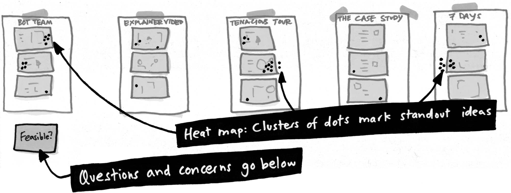
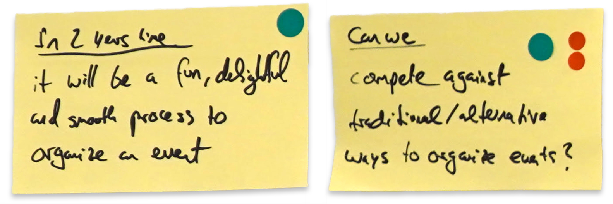
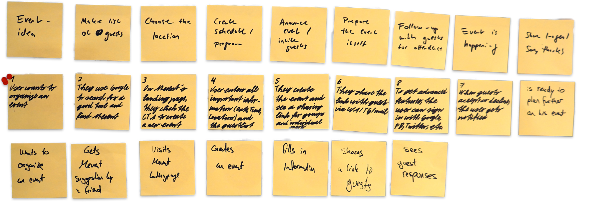
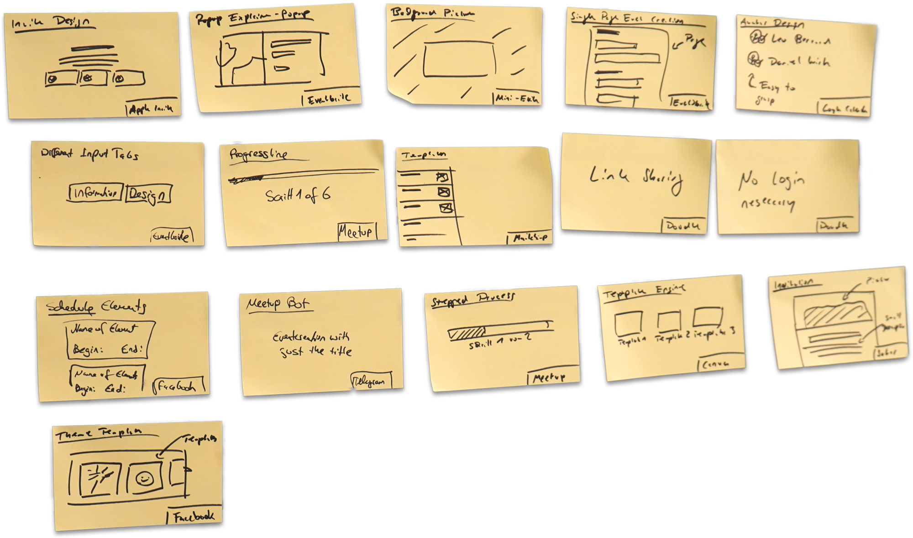
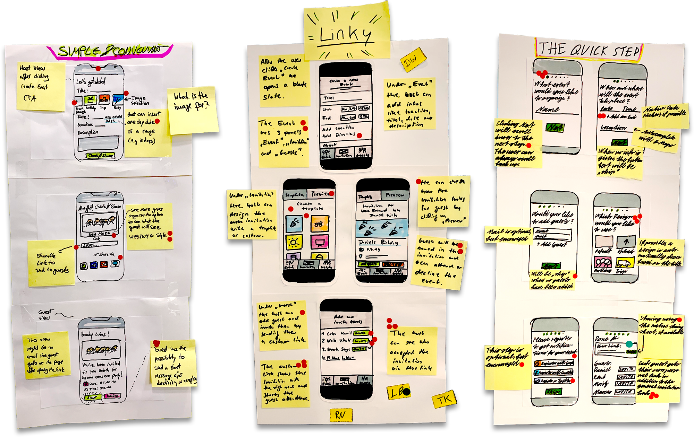
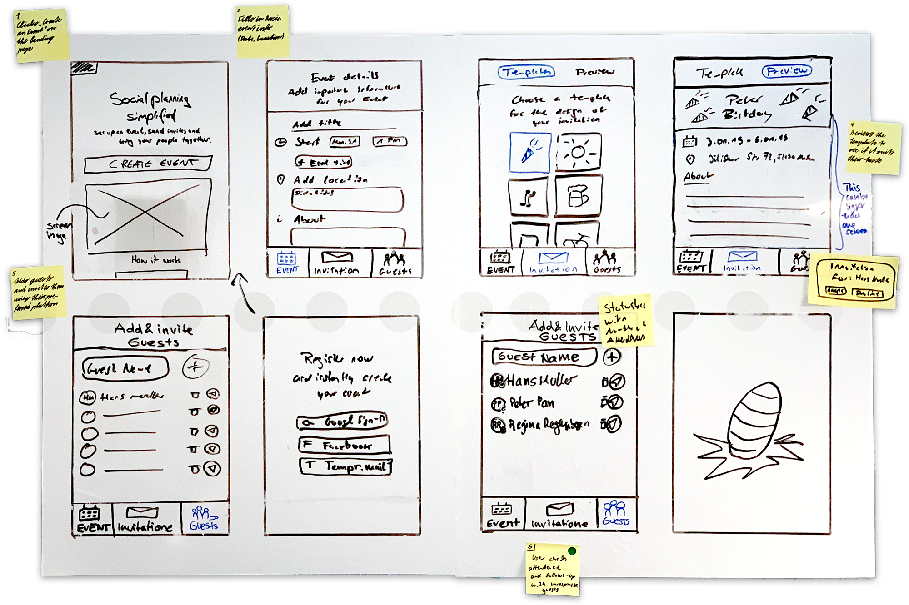
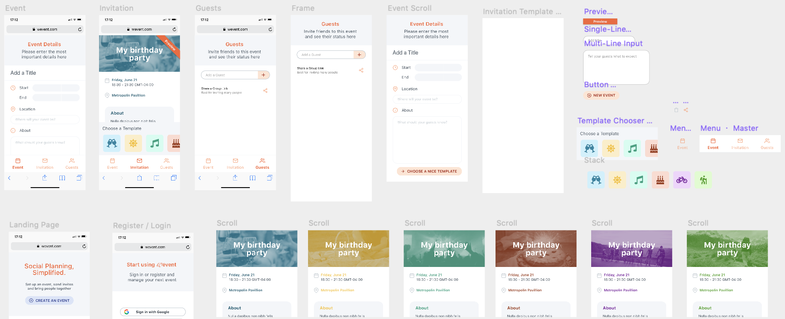

# Einleitung

Die Methodik, die für die Entwicklung digitale digitaler Produkte genutzt wird, hat sich in den letzten 50 Jahren gewandelt. Die zeitlichen Anforderungen an Entwicklerteams nehmen zu und der Markt für Apps wächst stetig. So stieg beispielsweise die Anzahl der verfügbaren Apps im App Store von ca. 61.000 im Jahr 2009 auf über 4 Mio. im Jahr 2019 [@statistaApps2019]. Dazu nutzen im Jahr 2019 geschätzt 3,3 Mio. Menschen weltweit ein Smartphone [@statistaUsers2018]. Auf ProductHunt, einer Plattform, auf der Entwickler ihre digitalen Produkte vorstellen können, wurden von 2017-2019 über 19.000 Produkte veröffentlicht. Das sind ca. 614 Produkte pro Monat oder ca. 20 Produkte pro Tag (siehe @fig:productHuntMonthly).

Methoden wie iterative und agile Softwareentwicklung, Scrum und Rapid Application Development (RAD) helfen Entwicklern dabei, effizienter zu arbeiten, auch wenn sich beispielsweise die Anforderungen an das Produkt häufig ändern [@larman2004agile, S. 27]. Minimum Viable Products (MVPs) werden dazu eingesetzt, das Potential eines Produktes zu testen, ohne zu viel zeit in die Entwicklung dieses zu investieren [@ries2009]. So können Produkte schneller an den Markt gebracht werden.

Für die Ausarbeitung von Ideen werden Methoden wie Design Sprints und Design Thinking eingesetzt. Vor allem Design Sprints haben das Ziel, in einer möglichst kurzen Zeit Ergebnisse zu erzielen [@poguntke2019, S. 37]. Bei Design Sprints, die von Crisp Studio, einer Design Sprint Agentur aus Aachen, durchgeführt wurden, hat sich diese Methode bewährt, jedoch verlor die Entwicklung des Produkts nach dem Sprint bei Kunden schnell an Momentum. Dies beeinflusst den Mehrwert des Design Sprints negativ.

Zwei große Aspekte der Effizienz von Design Sprints sind die genaue Struktur und das unabhängige Arbeiten an Aufgaben. Ist es möglich, diese Aspekte auf einen neuen Sprint zu übertragen, der auf den Design Sprint folgt und mit der selben Effizienz die Grundlage für die Entwicklung eines MVPs aufbauen kann?

# Zielsetzung

Ziel dieser Bachelorarbeit ist es, ein Konzept für einen Sprint zu entwickeln, der den Übergang vom Prototyp aus einem Design Sprint zum fertigen Minimum Viable Product (MVP) optimal überbrückt.

Im Rahmen dieser Bachelorarbeit soll die folgende Frage beantwortet werden:

> Wie kann aus einem fertigen Prototyp in einem festen, kurzen Zeitraum eine Sammlung an Design Komponenten entwickelt werden, die Entwicklern des MVPs die Arbeit erleichtert?

# Begründung

Design Sprints wurden 2012 von Jake Knapp entwickelt [@knapp2016, S. 5] und werden dazu eingesetzt, innerhalb von einer Woche eine Produktidee zu einem Prototyp auszuarbeiten und an potentiellen Nutzern zu testen. Design Sprints können für jede Art von Produkten – physisch und digital – eingesetzt werden [@knapp2016, S. 9]. Diese Arbeit konzentriert sich jedoch auf den Einsatz von Design Sprints im Softwarebereich, also beispielsweise für Apps und Websites.

Nach einem erfolgreichen Design Sprint entwickeln Firmen häufig auf Basis des dort entwickelten Prototyps ein Minimum Viable Product, das sie auf den Markt bringen können [@dockyard2017].

Der in dieser Bachelorarbeit ausgearbeitete Sprint, der im Folgenden Component Sprint genannt wird, soll Entwicklern die Implementierung des MVP vereinfachen, indem sie bereits alle nötigen UI-Komponenten in Form einer Pattern Library zur Verfügung gestellt bekommen. So können sie sich bei der Entwicklung des MVP mehr auf die Implementierung der Logik konzentrieren.

# Vorgehen

Um das Konzept für Component Sprints zu entwickeln, werden zuerst bestehende Grundlagen erörtert und relevante Konzepte und Frameworks vorgestellt. 

Basierend auf diesen Frameworks wird die erste Version des Component Sprints entwickelt. Darauf folgend wird ein empirischer Test des entwickelten Konzepts in Form eines Design Sprints mit anschließendem Component Sprint durchgeführt und die Ergebnisse sowie Erkenntnisse zusammengefasst.

Um das Konzept weiter zu verfeinern, wird eine qualitative Studie in Form von vier Interviews mit Personen aus relevanten Bereichen durchgeführt, in denen das Konzept, sowie bestehende Ergebnisse, vorgestellt werden und Einschätzungen über das Potential und mögliche Ausarbeitungsmöglichkeiten des Sprints eingeholt werden.

Letztlich werden Schritte zur Weiterentwicklung des Konzepts angerissen und dargelegt, wie Component Sprints in Zukunft ausgebaut werden können.

# Theoretische Grundlagen / Einordnung {#sec:grundlagen}

In den letzten 20 Jahren hat sich der Prozess, in dem Software entwickelt und veröffentlicht bzw. verbreitet wird, stark verändert. Vor 20 Jahren wurde Software hauptsächlich auf CDs verkauft. Ein normaler Release-Zyklus lag bei mehreren Monaten. Bugs in der Software konnten erst in der nächsten Version behoben werden, Feedback von Benutzern konnte erst Monate später umgesetzt werden [@knapp2019, 4:06].

Durch die Verbreitung des Internets wurde es einfacher, neue Versionen regelmäßiger zu veröffentlichen. Heute ist es normal, dass wöchentlich neue Updates für Software veröffentlicht werden. Analytics Tools wie Google Analytics[^1] und Mixpanel[^2] ermöglichen es Firmen, genaue Einblicke zum Benutzerverhalten in ihrer Software zu erlangen. So können potentielle Problemstellen in Programmen genauer identifiziert und behoben werden [@knapp2019, 14:23].

Die folgenden Kapitel konzentrieren sich auf die heutige Entwicklung von Apps und Websites. Die vorgestellten Konzepte und Frameworks sind für die Entwicklung des Component Sprints relevant.

## Design Sprints

Ein normaler Zyklus in der heutigen Entwicklung von Apps und Websites kann in vier Schritte unterteilt werden (siehe @fig:leanCycle):

- **Ideate:** Generierung und Ausarbeitung von Ideen
- **Build:** Umsetzung der Ideen in Software
- **Launch:** Veröffentlichung der Software auf dem Markt
- **Data:** Sammeln von Insights und User Feedback

![Klassischer Entwicklungszyklus nach Jake Knapp \[@knapp2018, S. 65\]](assets/DraggedImage.png){#fig:leanCycle}

Bei der Entwicklung von Apps ist es normalerweise notwendig, diesen Zyklus mehrere Male zu durchlaufen, um eine optimale Version zu erhalten. Dabei ist vor allem der Build-Schritt zeitaufwändig. Wenn der Launch nicht erfolgreich ist, wurden diese Ressourcen verschwendet.

![Design Sprint Zyklus \[@googleventures\]](assets/Design%20Sprint%20Cycle.jpg){#fig:sprintCycle}

Der Design Sprint ist ein Ansatz, der diesen Zyklus optimiert. Hierbei werden die Build- und Launch-Schritte durch Prototyping und User Testing ersetzt, sodass User Feedback schneller gesammelt werden kann (siehe @fig:sprintCycle).

![Struktur des gesamten Design Sprints \[@knapp2016, S. 17\]](assets/Design%20Sprint%20Structure.jpg){#fig:designSprintStructure}

Ein Design Sprint dauert in der Regel fünf Tage – Montag bis Freitag, siehe @fig:designSprintStructure – und wird vor Ort mit einem interdisziplinären Team von 4-7 Personen und einem Moderator durchgeführt. Die Tage sind zeitlich fest strukturiert und jegliche Form von Ablenkung, wie z.B. Handys oder Laptops, ist im Sprintraum nicht erlaubt. Ziel dieser Maßnahmen ist es, dass sich das Team fokussiert mit den Aufgaben auseinandersetzen kann [@knapp2016, S. 41]. Erarbeitete Informationen werden systematisch auf Post-its festgehalten, sodass jedes Teammitglied jederzeit darauf zugreifen kann [@knapp2016, p. 20].

Generell wird in Design Sprints auf offene Diskussionen verzichtet. Diese gelten als nicht effizient und geben Teilnehmern mit einer starken Meinung zu viel Gewichtung und Einfluss auf die Entscheidungen [@kahneman2013, K. 7]. Stattdessen werden Entscheidungen per Abstimmung, meist mit Hilfe von Klebepunkten, getroffen. Der CEO, Gründer, Produktmanager oder Head of Design hat als Decider in Abstimmungen eine größere Entscheidungskraft [@knapp2016, S. 34].

Am Montag wird die Problemstellung definiert. Vormittags legt das Team nach einer kurzen Einführung das Langzeitziel des Projekts und Fragen, die für den Sprint interessant sein könnten, fest. Darauf folgend wird eine Abbildung der erwarteten Customer Journey angelegt [@knapp2016, S. 65].

Nachmittags werden sogenannte Experteninterviews durchgeführt. Ziel dieser Interviews ist das Sammeln und Festhalten von Wissen, das häufig auf einzelne Teammitglieder verteilt ist [@knapp2016, S. 68]. Während der Interviews legen alle Mitglieder in Stille Notizen auf Post-its in Form von “How Might We” (“Wie können wir”) Fragen an. Eine Frage kann beispielsweise lauten: “Wie können wir das User-Onboarding vereinfachen?” oder “Wie können wir unser Produkt freundlich wirken lassen?”. Diese Fragen werden daraufhin an einer Wand sortiert, per Abstimmung priorisiert und die wichtigsten in die Customer Journey eingeordnet [@knapp2016, S. 80-88].

Am Dienstag sucht das Team online nach Konzepten, Komponenten und anderen Beispielen, die im Kontext der am Montag definierten Fragen und Ziele relevant sein könnten und präsentiert diese kurz. Für jede Komponente wird ein Post-it erstellt. Diese Post-its dienen als Inspiration für die spätere Erstellung von Lösungsansätzen [@knapp2016, S. 98-100].

![Struktur des Dienstages \[@knapp2016, S. 109\]](assets/DraggedImage-1.png)

Basierend auf diesen Ideen werden nun von allen Teammitgliedern Skizzen und Notizen angelegt. Diese werden über weitere Übungen zu einem Solution Sketch pro Person ausgearbeitet. Diese Sketches bilden in maximal 3 Schritten detailliert die Interaktion der Nutzer mit dem Produkt ab und werden den anderen Teammitgliedern gegenüber bis zum nächsten Tag nicht offengelegt [@knapp2016, S. 114-118].

Am Mittwoch entscheidet sich das Team für den besten Solution Sketch. Diese Entscheidung wird in 5 Schritten durchgeführt: “Art museum”, “Heat map”, “Speed critique”, “Straw poll” und “Supervote” [@knapp2016, S. 131].

Im ersten Schritt werden die Solution Sketches, die am Vortag erstellt wurden, aufgedeckt und nebeneinander aufgehangen. Die Sketches sind anonym, um eventuellen persönlichen Einflüssen entgegenzuwirken [@knapp2016, S. 132].

Darauf folgend markiert jedes Teammitglied auf jedem Solution Sketch mit Klebepunkten interessante Konzepte und Ideen. Fragen und Anmerkungen können per Post-it hinzugefügt werden. Dieser Schritt wird in Stille durchgeführt und gibt dem Team einen guten Überblick über interessante Bereiche in den Sketches [@knapp2016, S. 132-135].

Im dritten Schritt wird jeder Solution Sketch drei Minuten lang besprochen. Die Besprechung folgt einer festen Struktur, damit sie konstruktiv bleibt und sich das Team nicht in Details verliert. Die Ergebnisse der Besprechungen werden auf Post-its über den Solution Sketches aufgehangen [@knapp2016, S. 135-137].

Im vierten Schritt stimmt jedes Teammitglied für den Solution Sketch, den er am besten findet, ab und erklärt seine Entscheidung in einem ein-minütigen Vortrag [@knapp2016, S. 138-140]. 

Im letzten Schritt entscheidet sich der Decider für seine Favoriten, basierend auf den Abstimmungsergebnissen der anderen Teammitglieder, den Sprintfragen und dem festgelegten Langzeitziel. Diese Entscheidung ist absolut und die Grundlage für das folgende Prototyping [@knapp2016, S. 140-142]. Wenn mehr als ein Favorit ausgewählt wurde, wird gemeinsam entschieden, ob alle favorisierten Solution Sketches in einen Prototyp übernommen werden oder ob mehrere Prototypen erstellt werden sollen [@knapp2016, S. 145].

Am Mittwoch Nachmittag wird basierend auf den gewählten Solution Sketches ein oder mehrere Storyboards auf einem Whiteboard erstellt. Dies geschieht im Team, wobei der Decider auch hier das letzte Wort hat. Das Storyboard dient als Grundlage für den Prototypen und sollte so detailliert sein, dass der User Flow klar ist [@knapp2016, S. 148-156]. Zusammengefasst gilt in diesem Schritt das Mantra “When in doubt, take risks.” [@knapp2016, S. 156]: Der Design Sprint ist eine gute Möglichkeit, um riskante Entscheidungen zu testen.

Der Donnerstag ist dem Prototyping gewidmet. Hier wird auf Basis des erstellten Storyboards ein Klick-Dummy, bzw. Throwaway Prototype erstellt. Dieser Prototyp soll sich für Testnutzer am Freitag realistisch anfühlen, muss aber nur die Funktionalität abbilden, die am Freitag wirklich getestet wird. Umso mehr sich der Prototyp wie ein echtes Produkt anfühlt, desto mehr werden die Testnutzer authentisch reagieren [@knapp2016, S. 168-170].

Das Prototyping geschieht in Teamarbeit. So erstellen beispielsweise zwei Personen einzelne Komponenten oder Screens und eine Person kombiniert diese zu einem einheitlichen Prototyp. Zusätzlich ist eine Person für das Schreiben von Texten und eine oder mehr Personen für das Sammeln von Assets, wie Bilder und Icons, verantwortlich [@knapp2016, S. 171].

Die Person, die am nächsten Tag die Interviews mit Testnutzern durchführen wird, konzipiert während des Prototypings ein Skript, mit dem die Nutzer durch den Prototypen geführt werden [@knapp2016, S. 171].

Am Freitag wird der Prototyp an fünf Nutzern getestet. Nach einer kurzen Einleitung und generellen Fragen zum Nutzer wird dieser durch den Prototyp geführt. Die interviewende Person versichert dem Nutzer dabei, dass nicht er, sondern das Produkt getestet wird. Er kann daher nichts falsch machen und es wird nicht vorausgesetzt, dass er alle Aufgaben verstehen oder ausführen kann. [@knapp2016, S. 207]

![Aufbau der Interviews \[@knapp2016, S. 203\]](assets/DraggedImage-2.png)

Interviewer und Testnutzer sitzen beim Interview zu zweit in einem Raum. Das Gespräch wird per Video an die anderen Mitglieder des Sprint-Teams übertragen, die in einem anderen Raum sitzen. Diese Personen machen sich während des Interviews in stiller Einzelarbeit auf Post-its Notizen zu dem Feedback des Testnutzers [@knapp2016, S. 202-203].

Nach den Interviews werden die Notizen sortiert und gruppiert, sodass sich daraus Schlüsse über das weitere Vorgehen ergeben. Im Team wird nun mit Blick auf die am Montag definierten Sprintfragen und Langzeitziele über das weitere Vorgehen abgestimmt. Der Decider hat auch hier das letzte Wort [@knapp2016, S. 216-222].

Design Sprints werden von vielen Unternehmen nicht 100% so durchgeführt wie es in dem Buch *Sprint* des Erfinders Jake Knapp [@knapp2016] vorgeschlagen wird. Die Design Sprint Agentur AJ&Smart[^3] bietet beispielsweise einen Design Sprint in vier Tagen unter dem Namen “Design Sprint 2.0” an. Hier werden die ersten beiden Sprinttage in einen Tag zusammengeführt und die Übungen so angepasst, dass sie in der kürzeren Zeit durchgeführt werden können. So werden beispielsweise einzelne Experteninterviews in ein Gruppeninterview zusammengeführt, das auf 30 Minuten beschränkt ist [@smart2018].

Crisp Studio, einer Design Sprint Agentur aus Aachen[^4], orientiert sich am viertägigen Sprint von AJ&Smart. Dazu wird die Reihenfolge einiger Übungen getauscht, da sie so aus Sicht des Unternehmens mehr Sinn ergeben. Die Experteninterviews werden beispielsweise an den Anfang des ersten Sprinttages gelegt, sodass alle Teammitglieder bei den Sprintfragen und dem Langzeitziel bereits auf dem gleichen Stand sind. Zusätzlich enthalten die Sprints neue Übungen, wie z.B. Note-n-Map [siehe @cruchon2019], die den Prozess weiter vereinfachen. In den Design Sprints von Crisp Studio sind nicht alle Teammitglieder an allen vier Tagen anwesend – die Teammitglieder des Kunden müssen hier nur an den ersten beiden Tagen teilnehmen. Dies vereinfacht die Organisation des Sprints erheblich, da die Kunden sich nicht eine ganze Woche freihalten müssen. Das Prototyping und Testing wird von der Agentur übernommen [@nauheimer2019].

## Prototyping

Prototypen sind in ihrer Grundform im Duden als “[…] zur Erprobung und Weiterentwicklung bestimmte erste Ausführung […]“ definiert. Das Wort stammt vom Griechischen “prōtótypos”, übersetzt “ursprünglich”, ab [@dudenPrototyp]. Prototypen werden dazu eingesetzt, Ideen mit minimalem Aufwand zu testen. Prototyping bezeichnet die Erstellung eines solchen Prototypen.

![Kategorisierung der Arten von Prototyping \[@verner, S. 7\]](assets/DraggedImage-3.png){#fig:prototypingCategories}

Im Kontext der Softwareentwicklung lässt sich Prototyping grob in drei Kategorien einteilen (siehe @fig:prototypingCategories): Experimentelles, erforschendes und evolutionäres Prototyping [@verner, S. 7]. Diese Einteilung ist nicht absolut und die Begriffe variieren je nach hinzugezogener Quelle. So kann beispielsweise dem evolutionären Prototyping auch das Rapid Application Development (RAD) zugeordnet werden, das als Begriff erstmals 1988 von Barry Boehm [@boehm1988] im Kontext seines Spiral Models vorgestellt wurde. Dieser Begriff wurde jedoch auch durch das 1991 von James Martin vorgestellte Modell [@martin1991] geprägt, welches sich grundsätzlich von Boehms Modell unterscheidet. 

Der Prototyping-Schritt in Design Sprints ist ein Rapid Throwaway Prototyping oder kurz Throwaway Prototyping, das sich dem erforschenden Prototyping unterordnen lässt. Bei diesem Ansatz werden Prototypen mit Fokus auf Geschwindigkeit entwickelt. Die Qualität des Programmcodes und die Sorgfältigkeit der Entwicklung sind dabei nicht vorrangig, da der Prototyp nach der Evaluation nicht weiterentwickelt, sondern verworfen wird [@crinnion1992, S. 18]. 

![\[@knapp2016, S. 168\]](assets/DraggedImage-4.png){#fig:prototypingChanges}

Durch diese Grundlage fällt es dem Team meist leichter, Ideen zu verwerfen, da es so noch nicht zu viel Zeit in deren Entwicklung investiert hat [@knapp2016, S. 168]. @fig:prototypingChanges stellt diesen Sachverhalt vereinfacht dar.

## Minimum Viable Products

Ein Minimum Viable Product, kurz MVP, auf Deutsch “minimal überlebensfähiges Produkt“ [@wikiMVP], ist laut Eric Ries ein Produkt, das dem Entwicklerteam mit dem geringsten Aufwand die maximale Menge an validiertem Wissen über seine Kunden bietet [@ries2009].

MVPs werden eingesetzt, um zu erforschen, wie der Zielmarkt auf ein potentielles Produkt oder ein neues Feature bei bestehenden Produkten reagieren würde. So wird das Risiko minimiert, Zeit in die Entwicklung eines Produktes oder Features zu investieren, das letztendlich nicht genutzt wird und/oder sich nicht verkaufen lässt.

Die Definition von “Minimum” im Kontext des MVP ist laut Ries nicht festgelegt. So kann der Entwicklungsaufwand je nach Produkt zwischen wenigen Tagen und mehreren Monaten liegen [@ries2009].

Ähnlich wie im Fall des Begriffs “Prototyping” gibt es auch für das MVP verschiedene Definitionen. Der Begriff wurde erstmals 2001 von Frank Robinson als “[…] unique product that maximizes return on risk for both the vendor and the customer” [^5] [@robinson2001] definiert. Steve Blank definierte MVPs 2010 als “[…] Customer Development tactic to reduce engineering waste and to get product[s] in the hands of Earlyvangelists soonest” [^6] [@blank2010].

Ries’ Definition hat aktuell jedoch die größte Reichweite. Die meisten Definitionen bauen entweder auf seiner Definition oder auf der Definition von Steve Blank auf [@lenarduzzi2016, S. 119].

## Atomic Design

Atomic Design ist ein System zur hierarchischen Organisation und Strukturierung von UI Komponenten, das erstmals 2013 von Brad Frost auf seinem Blog vorgestellt und 2016 in dem Buch “Atomic Design” veröffentlicht wurde [@frost2016, Foreword].

![Struktur des Atomic Designs \[@frost2016, K. 2\]](assets/atomic-design-abstract-concrete.png){#fig:atomicStructure}

Das in seinem Buch beschriebene System bezieht sich hauptsächlich auf die Entwicklung von Websites, lässt sich jedoch auch für jede andere Form von Benutzerinterfaces einsetzen. Atomic Design unterteilt die eingesetzten UI Elemente in Atome, Moleküle, Organismen, Templates und Seiten (siehe @fig:atomicStructure). Komponenten aus diesen Kategorien bauen jeweils auf Komponenten aus der vorherigen Kategorie auf [@frost2016, K. 2].

Atome sind im Atomic Design die kleinste Einheit der Komponenten und können nicht weiter in kleinere Teile zerlegt werden. Gültige Atome sind beispielsweise Buttons, Eingabefelder, Labels, Überschriften und alle Elemente, die sich durch einen HTML Tag darstellen lassen [@frost2016, K. 2].

Moleküle bauen auf diesen Atomen auf und kombinieren diese zu Einheiten, die einen bestimmten Zweck erfüllen. So könnte ein Molekül “Suchfeld” beispielsweise aus den Atomen “Button” und “Eingabefeld” bestehen. Dieses Molekül kann nun überall verwendet werden, wo ein Suchfeld benötigt wird [@frost2016, K. 2].

Organismen sind komplexe Komponenten, die aus mehreren Atomen, Molekülen und anderen Organismen bestehen. Ein gültiges Molekül ist beispielsweise ein Header, so wie er in @fig:atomicHeader abgebildet ist. Dieser könnte aus einem Logo-Atom, einem Menü-Molekül und einem Suchfeld-Molekül bestehen [@frost2016, K. 2].

![Header-Organismus \[@frost2016, K. 2\]](assets/atomic-header.png){#fig:atomicHeader}

Templates bestehen aus mehreren Organismen und definieren das Layout in dem diese auf der Seite angeordnet werden sollen. Templates sind unabhängig von Inhalten und verwenden Platzhalter, um die Inhaltsstruktur zu definieren [@frost2016, K. 2].

Seiten sind mit Inhalten gefüllte Templates. Sie repräsentieren den fertigen Zustand der Website und lassen sich gut dazu verwenden um sicherzustellen, dass die Inhalte in den definierten Templates gut dargestellt sind. So können eventuelle Probleme, wie zu lange Überschriften oder unzureichende Bildformate, behoben werden, indem entweder das Template oder die Inhalte angepasst werden [@frost2016, K. 2].

Die von Frost vorgestellte Hierarchie ist nicht linear. So sollten beispielsweise nicht erst alle Atome gestaltet werden, bevor die Gestaltung der Moleküle beginnt, da dies mit hoher Wahrscheinlichkeit nicht zu einem einheitlichen Design führen wird [@frost2016, K. 2].

Durch den Einsatz von Atomic Design ist es einfacher, ein Benutzerinterface sowohl als Ganzes zu betrachten, als auch sich auf einzelne Komponenten zu konzentrieren. Die hierarchische Struktur trägt dazu bei, dass Komponenten nicht versehentlich in verschiedenen Kontexten mehrmals gestaltet werden. Dadurch werden spätere Anpassungen an einzelnen Komponenten ermöglicht, die sich konsequent auf das gesamte Design auswirken [@frost2016, K. 2].

Benutzerinterfaces, die auf dieses System setzen, sehen meist einheitlicher aus und sind dadurch verständlicher für Benutzer. Sie lassen sich dazu in Zukunft schneller um neue Komponenten erweitern, und bleiben dabei für das Entwicklungs- und Designteam übersichtlich [@frost2016, K. 4].

Frost schlägt in seinem Buch vor, die entwickelten Komponenten in einer Komponentenbibliothek, oder auch Pattern Library, zu sammeln. Diese ist direkt mit dem fertigen Produkt verbunden, sodass die dort enthaltenen Komponenten immer den aktuellen Zustand des Produkts abbilden. So werden in Zukunft Änderungen an den Komponenten direkt auf das Produkt angewendet und es kommt nicht zu unerwarteten Unterschieden zwischen Design und Code [@frost2016, K. 3].

## Design Systems

Design Systems ist ein von Alla Kholmatova entwickeltes Konzept und gleichnamiges Buch, das 2017 veröffentlicht wurde. Kholmatova beschreibt Design Systems als “[…] a set of connected patterns and shared practices, coherently organized to serve the purposes of a digital product”[^7] [@kholmatova2017, S. XII].

Ähnlich wie beim Atomic Design empfiehlt Kholmatova Unternehmen, eine Bibliothek für Muster, hier Pattern Library, anzulegen und zu pflegen. Sie unterscheidet bei diesen Patterns zwischen funktionalen Patterns, die das Verhalten und das Layout bestimmter Komponenten definieren und Wahrnehmungsmustern, die beispielsweise die Ästhetik und das Branding bestimmen [@kholmatova2017, S. XI]. Jedes Pattern stellt in dieser Bibliothek eine wiederverwendbare Lösung zu einem bestimmten Problem dar [@kholmatova2017, S. 22].

Anders als Frost in seinem Atomic Design Ansatz legt Kholmatova in ihrem Konzept keine feste Hierarchie für diese Patterns fest und unterscheidet explizit zwischen der Pattern Library und dem Design System selbst [@kholmatova2017, S. 18]. 

Eine gute Pattern Library hat keinen Wert, wenn sie im Team nicht richtig eingesetzt wird. Um diesem Problem vorzubeugen, ist es wichtig, dass alle Teammitglieder den gleichen Prinzipien folgen und eine geteilte Sprache sprechen. Diese sind neben der Pattern Library beide Teil des Design Systems [@kholmatova2017, S. 28-30].

Einem guten Design System liegen stabile Design Prinzipien zugrunde. Diese Prinzipien definieren, was im Kontext des Unternehmens und des entwickelten Produkts gutes Design ist und bieten eine gute Grundlage für die Entwicklung der Design Patterns [@kholmatova2017, S. 46-48].

Die Prinzipien des Salesforce Lightning Design Systems sind beispielsweise “Clarity”, “Efficiency”, “Consistency” und “Beauty”[^8] [@salesforce2019]. Sipgates Prinzip lautet “Purpose first”[^9] [@sipgategmbh]. Beide Unternehmen haben ihre Pattern Library auf diesen Prinzipien aufgebaut und öffentlich zur Verfügung gestellt.[^10]

Im Falle von sipgate ersetzt das aktuelle Design System die vorherige Pattern Library, welche mit Frosts Atomic Design Prinzipien entwickelt wurde. Corinna Baldauf beschreibt in einem Artikel auf sipgates Blog, dass die Pattern Library mit Atomic Design durch seine hierarchische Struktur auf Dauer unübersichtlich wurde, was dazu führte, dass Patterns nicht wiederverwendet wurden – “im Zweifelsfall baute man einfach ein neues Pattern” [@sipgate2018] – und Refactoring aufgrund der Abhängigkeiten zwischen Komponenten nicht mehr möglich war. Zusätzlich fehlte der Pattern Library ein übergreifender Style Guide, um die Einheitlichkeit des Aussehens und Verhaltens der Komponenten zu gewährleisten [@sipgate2018].

## Rolle des Component Sprints

Component Sprints können in Unternehmen und für Produkte eingesetzt werden, die noch kein Design System nutzen. Ziel des Component Sprints ist die Optimierung des Übergangs vom Prototyp zum fertigen MVP eines Produkts. Die in einem Component Sprint entwickelte Pattern Library verwendet eine abgewandelte Variante von Atomic Design. Sie soll den Entwicklern des MVPs die Arbeit erleichtern, indem sie auf definierte Designelemente zurückgreifen und sich dadurch auf die Implementierung der Geschäftslogik des Produktes konzentrieren können.

Ein Component Sprint sollte zwischen einem Design Sprint und der Entwicklung des MVPs stattfinden, da so der validierte Prototyp aus dem Design Sprint als Grundlage für die Patterns genutzt werden kann.

# Ausarbeitung des Konzepts für Component Sprints

Das Ziel eines Component Sprints ist die Erstellung einer Pattern Library für ein Produkt. Damit ein Component Sprint in einem festen Zeitraum zuverlässig wertvolle Ergebnisse liefert, sollte er einer festen Struktur folgen, ähnlich wie es bei Design Sprints der Fall ist.

Hypothesen, die in diesem Kapitel nicht belegt sind, werden im folgenden Kapitel in Form eines empirischen Tests überprüft.

Voraussetzung für einen Component Sprint ist ein validierter Prototyp, der bereits das finale Design des Produkts abbildet. Dieser wird als Grundlage bzw. Input des Component Sprints verwendet. Wenn das Unternehmen bereits ein definiertes CI bzw. Style Guide besitzt, sollte dieses zur Orientierung mit in den Component Sprint eingebracht werden.

Angelehnt an den Zeitrahmen von Design Sprints sollte ein Component Sprint in einem Zeitraum von vier bis fünf Tagen erfolgen. Aus persönlicher Erfahrung als Entwickler dürfte dieser Zeitraum für die Implementierung der Pattern Library ausreichen. Diese Hypothese wird im empirischen Test des Component Sprints überprüft.

Strukturell orientiert sich die Pattern Library des Component Sprints an einem Hybrid aus Atomic Design und Design Systems. Die Komponenten der Pattern Library sind in Atome, Moleküle und Templates unterteilt, wobei ein Molekül ausschließlich aus Atomen und nicht aus anderen Molekülen bestehen darf um die Komplexität der Struktur zu limitieren. Organismen und Seiten werden aus dem selben Grund aus der Struktur der Pattern Library ausgeschlossen. Design Systems schließt die Unterteilung der Komponenten nicht explizit aus und die Hierarchie soll Entwicklern während des Sprints helfen, die einzelnen Komponenten zu priorisieren, sodass keine Abhängigkeitsprobleme entstehen.

Um einem Unternehmen einen nachhaltigen Wert zu liefern, sollte das Ergebnis eines Component Sprints gut dokumentiert sein und seitens des Unternehmens einfach genutzt und um neue Komponenten erweitert werden können. Um dies zu erreichen, ist ein gutes Handoff des Sprint Teams an das Unternehmen wichtig.

Genau wie ein Design Sprint, kann ein Component Sprint sowohl innerhalb eines Unternehmens oder durch eine externe Agentur durchgeführt werden.

Das Sprint Team sollte für optimale Produktivität insgesamt aus maximal zehn Personen bestehen [@brooks1995, p. 31; @coplien1994, p. 7]. Je nach Komplexität des Produkts und damit der Anzahl an Komponenten dürfte ein Team von mindestens drei Personen jedoch auch ausreichen. Auch diese Hypothese wird im empirischen Test überprüft.

.png){#fig:storybookUi}

Als Basis für die Pattern Library kann Storybook[^11] verwendet werden. Storybook ist ein kostenloses, offenes Framework, das mit beliebten Web Libraries wie React[^12], Vue[^13] und Angular[^14] zusammenspielt. Storybook ermöglicht Entwicklern, Komponenten zu implementieren, zu dokumentieren und zu testen. Die Komponenten werden den Nutzern automatisch in einer übersichtlichen Benutzeroberfläche (siehe @fig:storybookUi) in allen möglichen Variationen zusammen mit Codebeispielen angezeigt [@storybook].

Um die Zusammenarbeit zwischen den Teammitgliedern zu vereinfachen, bietet sich Versionsverwaltungssoftware wie beispielsweise Git[^15] an. Diese Software erlaubt es mehreren Entwicklern, parallel an dem selben Projekt zu arbeiten. Änderungen werden in Form von sogenannten Commits gespeichert und mit anderen Entwicklern oder einem zentralen Server synchronisiert [@gitbook K. 1.1]. Als zentrale Platform für Git bieten sich GitHub[^16], GitLab[^17] oder BitBucket[^18] an.

Das Aufsetzen von Storybook und der Entwicklungsumgebung lässt sich nicht parallelisieren bzw. auf mehrere Teammitglieder aufteilen und sollte daher bereits vor dem Component Sprint geschehen, da alle anderen Aufgaben davon abhängen.

Die Struktur des Component Sprints lässt sich essentiell in drei Sektionen unterteilen: Vorbereitung, Implementierung und Handoff (siehe @fig:sprintStructure). Angelehnt an den Design Sprint 2.0 von AJ&Smart [@ajsmart2018] beginnt jeder Tag um 10:00 Uhr und endet um 17:00 Uhr. So können alle Teilnehmer des Sprints vor Beginn des Tages noch geschäftliche Angelegenheiten erledigen.

Ebenfalls orientiert am Design Sprint gibt es einen Moderator, der das Team durch den Component Sprint leitet und dem Team bei möglichen Fragen zur Verfügung steht.

.png){#fig:sprintStructure}

Der erste Tag ist der Vorbereitung gewidmet. Hier erklärt der Moderator vorerst allen Teilnehmern das Konzept von Component Sprints und die Entwicklungsumgebung, sowie Richtlinien zur Entwicklung. Es ist wichtig, dass alle Entwickler den selben Richtlinien folgen, damit das Ergebnis einheitlich und übersichtlich bleibt. Diese Richtlinien können beispielsweise die Ordnerstruktur, Namenskonventionen, Codestil und Art der Dokumentation festlegen. Eventuelle Fragen können hier geklärt werden, sodass alle Teilnehmer sich auf dem selben Wissensstand befinden.

Nach diesem Schritt wird der Prototyp bzw. das Ausgangsdesign Screen für Screen vom Team in einzelne Atome, Moleküle und Templates unterteilt. Jede Komponente wird als Post-it mit Name, Skizze und den möglichen Eigenschaften festgehalten und auf einer Wand gesammelt. Bei der Anordnung der Komponenten sollte bereits darauf geachtet werden, welche Komponenten voneinander abhängig sind. So entsteht schnell eine Übersicht über alle Komponenten, die implementiert werden müssen.

Am zweiten und dritten Tag werden die Komponenten implementiert. Dafür nimmt sich jeder Entwickler eine Komponente als Post-it von der Wand und implementiert und dokumentiert diese. Dieser Prozess lässt sich gut parallelisieren, da die meisten Komponenten aufgrund der vorgegebenen Struktur unabhängig voneinander entwickelt werden können.

Alle zwei Stunden führt das Team in Anleitung durch den Moderator ein Check-in durch, in dem der Status der Komponenten abgeglichen wird und mögliche Fragen und Probleme geklärt werden können.

Am Ende der beiden Tage sollte die Pattern Library fertig implementiert und zum Großteil dokumentiert sein.

Am vierten Tag überarbeitet das Entwicklerteam mögliche undokumentierte oder unvollständig dokumentierte Komponenten und korrigiert eventuelle Abweichungen von den Richtlinien. Falls am Vortag nicht alle Komponenten implementiert werden konnten, kann der Vormittag des Tages dazu genutzt werden, die Implementierung so weit wie möglich fertigzustellen.

Am Nachmittag des vierten Tages wird die Pattern Library an das Entwicklerteam abgegeben, welches diese in das MVP integriert. Im Rahmen des Handoffs stellt der Moderator die Pattern Library vor und zeigt, wie sie in ein Projekt integriert werden kann. Die Entwickler des MVP-Entwicklerteams können hier mögliche Fragen mit den Entwicklern des Component Sprint Teams klären und dieses Wissen an ihr Team weitergeben.

Nach dem Handoff ist die Zusammenarbeit mit dem MVP-Entwicklerteam vorerst beendet. Zum Ende des Component Sprints wird innerhalb des Component Sprint Teams eine Retrospektive durchgeführt. Hier hält der Moderator fest, was während des Sprints gut funktioniert hat und an welchen Stellen noch Optimierungsbedarf besteht. Dieses Wissen sollte dazu genutzt werden, den nächsten Component Sprint zu optimieren [@dyba2014, S. 290].

# Empirischer Test des entwickelten Konzepts

Um das im letzten Kapitel ausgearbeitete Konzept zu testen und die dort aufgestellten Hypothesen zu überprüfen, bietet sich die Durchführung eines Component Sprints im Anschluss an einen Design Sprint an, in dem eine neue Produktidee zu einem validierten Prototyp ausgearbeitet wird. 

Um die zeitlichen und personenbezogenen  Grenzen des Konzepts zu testen, wird der Component Sprint in vier Tagen und mit drei Teilnehmern durchgeführt.

Die Produktidee ist für diesen Test eine App, mit der Nutzer Events wie beispielsweise Geburtstage, Partys oder Spielabende im kleinen Rahmen planen können. Das Einladen von Gästen soll plattformunabhängig per Link funktionieren und eingeladene Personen sollen direkt über die App die Möglichkeit haben, zu- oder abzusagen. Die App trägt den Namen Wevent und soll so einfach wie möglich zu bedienen sein, sodass Nutzer keine großen Hindernisse überwinden müssen, um die App zu verwenden.

Der Design Sprint für diese Produktidee wird in Kooperation mit Crisp Studio durchgeführt. Das Design Sprint Team besteht aus Daniel Wirtz[^19], René Nauheimer[^20] und mir. René übernimmt die Rolle des Moderators, beteiligt sich jedoch auch an den Aufgaben. Ich übernehme die Decider-Rolle. Für den Design Sprint wird auf die Struktur des Design Sprints 2.0 von AJ&Smart zurückgegriffen. So dauert der Design Sprint nur vier statt fünf Tage. 

Der Component Sprint wird in der darauffolgenden Woche zusammen mit zwei Entwicklern, die im Bereich Web Development tätig sind, durchgeführt. Hier besteht das Sprint Team aus Marcus Weiner[^21], Moritz Gunz[^22] und mir. Ich übernehme in diesem Sprint die Rolle des Moderators, beteilige mich aber auch mit an der Entwicklung.

Da alle Teammitglieder bereits Erfahrung in der Entwicklung mit React haben, wird dieses Framework in Kombination mit Storybook für den Component Sprint eingesetzt. Für die Kollaboration wird Git auf GitHub eingesetzt.

Die Zeiten der Implementierung der Komponenten werden anhand der Commit Logs auf GitHub festgehalten und können nach dem Test ausgewertet werden.

## Ablauf

Der Design Sprint begann am Montag der ersten Projektwoche nach Aufbau des Sprintraums und kurzer Einleitung mit einem Experteninterview. Hier beschrieb der Decider die Problemstellung und die Idee der App Wevent. Wichtige Punkte aus dem Gespräch wurden in Form von “How might we”-Fragen auf Post-its festgehalten und im Anschluss an das Gespräch in die Kategorien *Onboarding*, *Information*, *Ausrichtung* und *Misc* unterteilt. Über diese Fragen wurde nun abgestimmt. Jeder Teilnehmer bekam dafür zwei Stimmen in Form von Klebepunkten, der Decider vier.

{#fig:sprintQuestion}

Im Anschluss wurden Langzeitziele der App sowie mehrere Sprintfragen vorgeschlagen. Mithilfe von Klebepunkten wurde jeweils über den passendsten Vorschlag abgestimmt. Das Langzeitziel des Sprints wurde auf “In two years’ time, it will be a fun, delightful, and smooth process to organize an event” festgelegt. Die Sprintfrage lautete: “Can we compete against traditional/alternative ways to organize events?” (siehe @fig:sprintQuestion).

{#fig:userFlow}

{#fig:sprintMap}

Um herauszufinden, welcher Bereich der App-Idee im Fokus des Sprints stehen sollte, legte jedes Teammitglied einen User-Flow in maximal acht Schritten an, den ein potentieller Benutzer durchlaufen könnte (siehe @fig:userFlow). Diese Schritte wurden als Grundlage genutzt, um eine Map zu erstellen, die den Flow in drei Phasen – *Discover*, *Learn* und *Use* – unterteilt. Nach gemeinsamer Absprache wurde der Fokusbereich auf das Erstellen und Teilen eines Events und auf den Check-In für Gäste festgelegt (siehe @fig:sprintMap). Dem Fokusbereich wurden relevante “How might we”-Fragen zugeordnet.

{#fig:lightningPostIts}

Am Nachmittag wurden zur UI-Inspiration Ideen aus bestehenden Websites gesammelt und in Lightning Demos vorgestellt. Die Ergebnisse wurden in Form von Post-its festgehalten (siehe @fig:lightningPostIts).

{#fig:sketches}

Auf Grundlage dieser Ergebnisse und den am Vormittag erarbeiteten Fragen und Zielen zeichnete nun jedes Teammitglied Skizzen eines möglichen UI-Layouts. Diese wurden in Form von Crazy 8s optimiert und als 3-Part-Sketch (@fig:sketches) zu einem User-Flow ausgearbeitet.

Am Dienstag wurde der beste 3-Part-Sketch aus den drei erstellten Sketches durch mehrere Abstimmungen ausgewählt. Der Sketch mit dem Titel “Linky” erhielt am meisten Stimmen. Der in dem Sketch abgebildete Flow wurde – ähnlich wie im User-Flow-Schritt am Vortag – in einem User-Test-Flow abgebildet. Aus den gesammelten Ressourcen wurde nun in Teamarbeit ein acht-teiliges Storyboard erstellt (siehe @fig:storyboard).

{#fig:storyboard}

Dieses Storyboard wurde am Mittwoch in Framer[^23] als testbarer Prototyp gebaut (siehe @fig:prototyping). Framer ist ein Tool, mit dem sich Prototypen mit wenig Aufwand erstellen lassen. Aufwändigere Teile des Prototypen können direkt als Code auf Basis von React implementiert werden. Das Prototyping dauerte hier länger als geplant, sodass die Endzeit des Tages von 17:00 Uhr auf 23:00 Uhr verlegt werden musste. Da die Benutzerinterviews am nächsten Tag von dem fertigen Prototypen abhängig sind, musste zumindest der User-Flow noch vollständig abgebildet werden.

{#fig:prototyping}

Am Donnerstag wurden die Benutzerinterviews durchgeführt. Dazu wurden im Vorhinein fünf Testpersonen organisiert, die zu dem Interview vor Ort erscheinen konnten. Diese Personen wurden einzeln von dem Moderator durch den Prototypen geleitet. Nach der Vorstellung und dem Test des Prototypen fragte er jede Testperson, welche drei Wünsche sie an die App hätte.

{#fig:interviewNotes}

Die Interviews wurden mithilfe von OBS Studio[^24] per YouTube live an den Rest des Teams übertragen, der sich in einem anderen Raum gleichzeitig Notizen dazu machen konnte. Diese Notizen waren in die fünf Schritte, die der Nutzer im Prototyp durchläuft, die drei Wünsche und weitere Anmerkungen unterteilt (siehe @fig:interviewNotes). Jede Notiz wurde entweder als positiv (gelb), negativ (blau), Wunsch (rot) oder als Anmerkung zum Interview selbst markiert.

Am Freitag wurden die Notizen aus den Nutzerinterviews in Form eines verkürzten Iteration Sprints zusammengefasst und festgehalten.[^25] Am Nachmittag wurde die Entwicklungsumgebung für den folgenden Component Sprint eingerichtet.

Der Component Sprint begann am Dienstag der folgenden Woche mit einer kurzen Einführung in das Konzept, einer Vorstellung des Prototyps und einem Austausch über den besten Codestil, sowie über die Anwendung der Prinzipien des Atomic Design im Kontext von Web Apps.

Nachdem alle offenen Fragen geklärt werden konnten, wurde auf den Computern der Teammitglieder die Entwicklungsumgebung eingerichtet, sodass alle Entwickler an der Pattern Library arbeiten konnten.

Daraufhin wurde der Prototyp unter Anleitung des Moderators in einzelne Komponenten zerlegt. Neben den normalen Komponenten wie Atomen und Molekülen entstanden hierbei auch Komponenten, die in keine der vorgegebenen Kategorien passten. Da die meisten dieser Komponenten das Layout beeinflussten, wurde eine neue Kategorie “Layout” erstellt. Insgesamt entstanden bei der Zerlegung 29 Komponenten, unterteilt in neun Atome, elf Moleküle, vier Layout-Komponenten und fünf Templates (siehe @fig:sprintComponents). Ein Atom und zwei Layout-Komponenten wurden erst im späteren Verlauf des Sprints hinzugefügt uns sind daher in @fig:sprintComponents noch nicht abgebildet.

{#fig:sprintComponents}

Das Zerlegen des Prototyps dauerte nicht so lange wie geplant, sodass der Tag bereits um 15 Uhr beendet werden konnte.

Am Mittwoch begann das Team mit der Implementierung und Dokumentation der Komponenten. Hierzu nahm sich jedes Teammitglied eine Komponente von der Post-it-Wand. Komponenten, an denen gerade gearbeitet wurde, wurden in eine “Doing”-Spalte verschoben, fertige Komponenten in eine “Done”-Spalte. So hatte jedes Teammitglied jederzeit einen Überblick über den Fortschritt.

Reguläre Check-Ins wurden alle zwei Stunden vom Moderator durchgeführt, jedoch konnten viele der Fragen auch schon während der Entwicklung geklärt werden.

Insgesamt konnte das Team am Mittwoch zehn der 29 Komponenten implementieren. Fünf Komponenten waren noch in Arbeit. Die Endzeit des Tages wurde nicht strikt eingehalten, sodass der Sprintraum erst um 20:00 Uhr verlassen wurde – drei Stunden nach dem geplanten Ende.

Am Donnerstag konnten bis auf zwei Templates alle Komponenten erfolgreich implementiert werden, jedoch dauerte der Tag auch hier länger als geplant und der Sprintraum wurde erst um 21:00 Uhr verlassen.

Die letzten beiden Templates wurden am Freitag Morgen implementiert. Daraufhin wurden alle Komponenten auf Korrektheit und Vollständigkeit hin kontrolliert, eventuelle Fehler behoben und die Dokumentation vervollständigt.

Da es in diesem Component Sprint keinen Kunden im klassischen Sinne gibt, wurde das Handoff übersprungen und die Retrospektive vorverlegt. Diese dauerte insgesamt ca. 1:30 Stunden.

Der Sprintraum wurde am Freitag um 15:00 Uhr verlassen.

## Ergebnisse

Zusammengefasst wurde in dem empirischen Test in einem Zeitraum von zwei Wochen eine grobe Idee zu einem validierten App-Prototypen und einer darauf abgestimmten Pattern Library ausgebaut. Mit Hilfe dieser Pattern Library kann im nächsten Schritt das MVP der App entwickelt werden.

Die Ergebnisse des empirischen Tests sind in Form des fertigen Prototyps[^26] und der entwickelten Pattern Library[^27] online verfügbar.

Da im Component Sprint zwei Tage um insgesamt sieben Stunden überzogen wurden, kann die Hypothese, dass drei Entwickler in vier Tagen für einen Component Sprint mit einer Größenordnung von 29 Komponenten ausreichen, als widerlegt gelten.

| Type     | Count | ø Time  | Median Time | ø Commits |
|----------|------:|--------:|------------:|----------:|
| Atom     |     9 | 1:30:23 | 0:48:00     | 13,2      |
| Molecule |    10 | 1:20:12 | 1:12:45     | 8,9       |
| Layout   |     5 | 1:21:48 | 0:57:00     | 3,0       |
| Template |     5 | 2:30:30 | 2:27:00     | 4,0       | 

: Durchschnittliche Entwicklungszeiten der Komponenten

Die durchschnittlichen Entwicklungszeiten der einzelnen Komponenten unterscheiden sich mit der Ausnahme von Templates nicht groß voneinander. Um zukünftige Component Sprints besser planen zu können, bietet es sich an, für Atome, Moleküle und Layout-Komponenten jeweils ca. 2 Stunden Entwicklungszeit einzuberechnen. Für Templates sollten 3 Stunden einberechnet werden. Diese Zeiten enthalten jeweils 30 Minuten Pufferzeit, um eine vollständige Entwicklung zu gewährleisten, auch wenn die Entwicklung der Komponenten länger dauern sollte als geplant. Die genauen Zeiten der einzelnen Komponenten sind in @tbl:componentTimesDetailed aufgeschlüsselt.

$$1 \text{ Tag} + \frac{24 \text{ Komponenten} * 2 \text{ h} + 5 \text{ Layouts} * 3 \text{ h}}{6 \text{ h/Tag} * 3 \text{ Entwickler}} = 4,5 \text{ Tage}$$ {#eq:days3}

$$1 \text{ Tag} + \frac{24 \text{ Komponenten} * 2 \text{h} + 5 \text{ Layouts} * 3 \text{h}}{6 \text{ h/Tag} * 4 \text{ Entwickler}} = 3,625 \text{ Tage}$$ {#eq:days4}

Basierend auf diesen Daten und mit der Annahme, dass die Arbeitsleistung proportional mit der Anzahl der Entwickler steigt, hätte der Component Sprint mit drei Entwicklern in fünf Tagen (@eq:days3) oder mit vier Entwicklern in vier Tagen (@eq:days4) ohne Überstunden gelingen können. Diese Annahme wurde jedoch bisher noch nicht bestätigt und könnte Gegenstand einer weiteren Überprüfung werden.

## Erkenntnisse

Die folgenden Erkenntnisse wurden in der Retrospektive am Ende des Component Sprints gesammelt.

Das Tooling des Component Sprints mit Storybook, React und Linaria wurde positiv wahrgenommen. In Zukunft wäre es einfach, die Pattern Library des Component Sprints um UI Testing bzw. Visual Diffing zu erweitern, um sicherzustellen, dass alle Komponenten auch nach möglichen Änderungen gegebene Grundvoraussetzungen erfüllen und sich das Aussehen nur kontrolliert verändert. Hierzu eignen sich Dienste wie Percy[^28] oder Chromatic[^29], die sich in Storybook integrieren lassen und dieses Testing automatisieren können.

Durch Konzentration auf die Implementierung von UI-Komponenten kam es selten vor, dass ein Teammitglied in der Umsetzung nicht weiterkam. Da es innerhalb einer Hierarchieebene, wie z.B. bei Atomen, keine Abhängigkeiten zwischen Komponenten gab, konnte zudem das “Together Alone”-Prinzip aus Design Sprints gut angewendet werden. So konnten die Teammitglieder unabhängig voneinander arbeiten, was zur Annahme führte, dass die Anzahl der Teammitglieder ohne große Einbußen der Produktivität variiert werden könnte.

Um den Component Sprint in Zukunft noch effizienter zu gestalten, wäre es sinnvoll, bereits im Vorhinein feste Vorgaben für Farben, Formen und die generelle CI des Produktes festzulegen um Unklarheiten bei der Implementierung vorzubeugen. Im Falle des Test-Sprints war das größte Problem die Definition der Farben, die in den Komponenten verwendet werden sollten.

Zusätzlich zu strikteren Designvorgaben wünschte sich das Sprint Team eine Design Role als Teil des Teams, die sich um die visuelle Kohärenz der Pattern Library kümmert und eventuelle Fragen der Entwickler beantworten kann. Im Optimalfall sollte diese Design Role aus dem Unternehmen kommen, für das die Pattern Library entwickelt wird. So kann die Designsprache des Unternehmens von vornherein berücksichtigt werden.

Der Idee, Entwickler des Kundenteams mit in den Component Sprint einzubeziehen, stand das Sprint Team skeptisch gegenüber. Der größte Kritikpunkt war hier, dass diese Developer Role eventuell den Fortschritt zurückhalten könnte, da sie durch bisherige Verfahren im Unternehmen bereits geprägt ist. Auf der anderen Seite besitzt diese Person auch nützliches Wissen, das bei der Entwicklung der Pattern Library helfen könnte.

Dem Moderator gegenüber wünschte sich das Team mehr Moderation und eine ausführlichere Einführung in das Thema für Mitglieder, die noch nicht mit den Konzepten von Design Systems, Atomic Design und Component Sprints gearbeitet haben.

Zusammengefasst war das gesamte Sprint Team mit dem Component Sprint zufrieden, sah jedoch noch Potential zur Optimierung des Konzepts für zukünftige Sprints.

# Qualitative Studie zur Verfeinerung des Konzepts

Um das Konzept der Component Sprints weiter auszuarbeiten, bietet sich eine qualitative Studie in Form von Experteninterviews mit Personen aus digitalen Firmen verschiedener Größen an.

Diese Experteninterviews bieten qualitative Einblicke in das Wissen der Experten und deren Sicht auf bestimmte Situationen [@glaeser2010, S. 13], in diesem konkreten Fall auf die Arbeitsumgebung, die Arbeitsweisen und die Anforderungen in ihrem Unternehmen.

Der Begriff “‘Experte’ beschreibt [hierbei] die spezifische Rolle des Interviewpartners als Quelle von Spezialwissen über die zu erfor­schenden […] Sachverhalte.” [@glaeser2010, S. 12].

## Studiendesign

Insgesamt werden vier Interviews durchgeführt – zwei davon mit Personen aus Agenturen, die digitale Projekte für andere Firmen konzipieren und umsetzen und zwei mit Personen, die aktiv an eigenen Produkten arbeiten. Die Firmengröße reicht hierbei von einem Startup mit fünf Mitarbeitern [@saym2019] bis hin zu einem Großunternehmen mit über 50000 Mitarbeitern (anonym).

Das Ziel dieser diversen Auswahl ist die Gewinnung von vielen verschiedenen Perspektiven auf das Konzept der Component Sprints und dessen Potential als Dienstleistung in verschiedenen Situationen.

Als Interviewte haben sich folgende Personen bereiterklärt:

- Daniel Bogdoll, CEO bei SAYM[^30] (23.8.2019)
- Niels Anhalt, Director bei nexum AG[^31] (27.8.2019)
- Eine anonyme Person aus der Automobilbranche (28.8.2019)
- Markus Mazur, Geschäftsführer bei Duplexmedia[^32] (2.9.2019)

Die anonyme Person wird im Folgenden als (anonym) bezeichnet.

### Entwicklung des Interviewleitfadens

Um den interviewten Personen genug Freiraum zu lassen, eigene Ideen und Gedanken mit in das Interview einbringen zu können, wird das Interview semistrukturiert aufgebaut. Hierdurch soll ein offenes Gespräch ermöglicht werden, sollte die interviewte Person sich dies wünschen.

Zur Einordnung der interviewten Personen in ihr Arbeitsumfeld beginnen die Interviews vorerst mit Fragen zur Person. Hierzu werden folgende Fragen gestellt:

- Wo arbeitest du?
- Was bietet dein Produkt / deine Firma?

Darauf folgend wird die interviewte Person bezüglich der theoretischen Grundlagen befragt, um zu erfahren, inwiefern sie bereits mit den in @sec:grundlagen vorgestellten Konzepten – insbesondere mit Design Sprints und Component Systems bzw. Pattern Libraries – vertraut ist. Zusätzlich ist die Erfahrung der Person mit dem Einsatz dieser Konzepte interessant:

- Habt ihr schon mit Design Sprints gearbeitet?
- Welche Vor- und Nachteile siehst du bei Design Sprints?
- Mit welchen Frameworks arbeitet ihr?
- Nutzt ihr eine Pattern Library für das Design eures Produktes?
- Welche Vor- und Nachteile siehst du bei Pattern Libraries?

Im Anschluss daran wird der interviewten Person das Konzept der Component Sprints, sowie ein Bericht des empirischen Tests anhand des Beispielprojekts Wevent inklusive der Ergebnisse vorgestellt. Diese beinhalten sowohl den Prototypen als auch die auf Grundlage dessen entwickelte Pattern Library. Basierend auf diesen Informationen kann die interviewte Person nun nach ihrer Einstellung zu dem Konzept befragt werden.

- Hast du generell Fragen zu dem Konzept?
- Wo siehst du in Component Sprints Potential?
- Wo könnte es zu Problemen kommen?
- Könntest du dir für dein Unternehmen so einen Sprint vorstellen?

Daraufhin wird die Person nach ihrer Einschätzung zu potentiellen Zielgruppen für Component Sprints befragt. Diese Frage ist für die Weiterentwicklung des Konzepts interessant:

- Für welche Zielgruppe könnte der Component Sprint interessant sein?

Letztlich erhält die interviewte Person die Möglichkeit, eigene Gedanken oder Ideen zu dem Konzept zu formulieren:

- Hast du noch Gedanken oder Ideen zu dem Konzept?

Es werden nicht alle Fragen auf alle Experten zutreffen, sodass manche Fragen je nach Interview leicht angepasst oder ausgelassen werden.

Die Experteninterviews sind für eine Dauer von maximal einer Stunde angelegt. Um die Ergebnisse des empirischen Tests sehen zu können, ist es während der Interviews nötig, dass die interviewte Person den Bildschirm des Interviewers sehen kann. Daher werden Drei der Interviews per Videokonferenz und ein Interview in Person vor Ort durchgeführt.

Letztendlich nahmen die Interviews mit Markus Mazur und Niels Anhalt die gesamte Stunde in Anspruch. Die anderen beiden Interviews dauerten 25 (anonym) bzw. 40 (Daniel Bogdoll) Minuten.

## Ergebnisse

Im Folgenden werden die Ergebnisse der vier Interviews zusammengefasst. Die Transkriptionen der Interviews befinden sich sowohl im Anhang als auch online.[^33]

Das Konzept der Component Sprints wurde in allen Interviews grundsätzlich positiv aufgenommen, jedoch wurden einige Punkte angesprochen, die noch optimiert werden können. Daniel sieht in dem Konzept Potential (Daniel, Z. 263pp) und würde in Zukunft gerne einen Component Sprint für SAYM durchführen (Daniel, Z. 442pp) und Markus erwähnte, dass der Sprint für die Entwicklung der eigenen Firmenwebsite interessant gewesen wäre (Markus, Z. 388pp). (anonym) sieht zwar persönlich keinen Mehrwert, da sie für das Zeichnen und Entwickeln von Prototypen und nicht für die Umsetzung der Produkte zuständig ist, kann sich die Sprints jedoch für ihr Unternehmen aus Perspektive der Entwicklungsteams gut vorstellen (anonym, Z. 232pp).

Sowohl (anonym) als auch Niels hatten bereits mit Design Sprints gearbeitet und gute Erfahrungen damit gemacht (anonym, Z. 35p; Niels, Z. 40pp). Markus hat Design Sprints noch nicht verwendet, ist aber interessiert daran und hat sich mit der Methodik bereits auseinandergesetzt (Markus, Z. 164pp). Niels gefällt an Design Sprints besonders der kurze Zeitraum, in dem ein Sprint durchgeführt wird (Niels, Z. 46p) und dass er “[…] so kompakt ist und wirklich alle Phasen [der Ideation] durchläuft” (Niels, Z. 43p). (anonym) sieht Design Sprints als sinnvoll an, um schnell zu verstehen, wie Kunden eine Idee sehen könnten (anonym, Z. 39p), hinterfragte im Interview jedoch, wie repräsentativ die Testergebnisse mit nur fünf Nutzern sind (anonym, Z. 42pp).

Keiner der vier Experten hatte bisher mit einer Pattern Library gearbeitet.

Alle interviewten Personen konnten sich als Zielgruppe der Component Sprints sowohl Startups als auch größere Unternehmen vorstellen (Daniel, Z. 364pp; anonym, Z. 235p; Niels, Z. 619pp; Markus, Z. 469pp). Markus fügte der Einschätzung hinzu, dass die Art der Produkte wichtiger sei als die Größe des Unternehmens. So sei der Component Sprint seiner Ansicht nach beispielsweise für Apps und Web-Apps besser geeignet als für Websites, da sich bei Websites nicht so viele Elemente wiederholen wie in Apps (Markus, Z. 466pp).

Ein wichtiger Punkt, der sowohl von Daniel als auch von (anonym) und Niels angesprochen wurde, ist das Einbeziehen von Entwicklern und anderen Mitarbeitern wie z.B. UX-Designern seitens des Kunden in den Component Sprint. Diese Mitarbeiter können ihr Knowhow gut in die Entwicklung der Komponenten einbringen und neues, im Component Sprint erworbenes Wissen im Gegenzug wieder an ihr Team weitergeben (Daniel, Z. 379pp). Dazu könnte die Akzeptanz der Pattern Library gegenüber diesen Entwicklern steigen, da sie im Sprint die Möglichkeit haben, die Entwicklung mitzugestalten (anonym, Z. 170pp). UX-Designer könnten in der Entwicklung helfen, wenn beispielsweise bestimmte Zustände von Komponenten noch nicht visuell definiert sind, da sie bereits Wissen über das Branding des Kunden und einen besseren Blick für Design haben (Niels, Z. 568pp).

Bei der Annahme, dass ein Component Sprint zwischen dem Design Sprint und der Entwicklung des MVPs stattfinden sollte, gingen die Meinungen der Interviewten Personen auseinander. So schlug Daniel vor, den Sprint nach der Entwicklung des MVPs und vor der Entwicklung des finalen Produktes anzusetzen, da MVPs meist wenige wiederverwendbare Elemente enthalten und nach der Testphase im Optimalfall verworfen würden, sodass die Entwicklung der Pattern Library so keinen nachhaltigen Wert liefere (Daniel, Z. 266pp). 

Niels würde den Component Sprint vor der Entwicklung des MVPs durchführen, sieht aber einen zwischengeschobenen Iteration Sprint als wichtig an, um den Prototyp mithilfe des im Design Sprint gesammelten Feedbacks zu überarbeiten (Niels, Z. 241pp). Als Startup, das “relativ schnell mit einem MVP […] an den Markt gehen muss” biete es sich jedoch an, den Component Sprint hinter die Entwicklung des MVPs zu schieben (Niels, Z. 384p). 

(anonym) sah aus der Perspektive ihres Unternehmens mehr Wert darin, den Component Sprint einmalig für das Branding des gesamten Unternehmens anstatt nur für ein Produkt durchzuführen, sodass alle Teams bei der Entwicklung von neuen Projekten auf die selbe Pattern Library zugreifen können (anonym, Z. 226pp).

Aus Sicht der beiden Agenturen Duplexmedia und Nexus AG wurde die Abhängigkeit von Kunden und anderen Stakeholdern besonders betont. “Das Hauptproblem, das ich immer sehe, auch bei den Design Sprints, ist, dass man es schafft, eine bestimmte Anzahl von Kunden wirklich für einen gewissen Zeitraum fokussiert an etwas arbeiten zu lassen, ohne Unterbrechung” (Markus, Z. 280pp), beschrieb Markus im Zusammenhang mit der Teamzusammenstellung der Component Sprints. Niels betonte: “[…] sobald du individueller wirst im Interface und auch viel näher Markenthemen berührst, dann hast du da einfach nochmal einen anderen Abstimmungsaufwand […]” (Niels, Z. 289pp). Diese beiden Punkte sollten beim weiteren Ausbau des Konzepts beachtet werden.

# Weiteres Vorgehen{#sec:weiteresVorgehen}

Im Rahmen dieser Bachelorarbeit konnte nur eine Variante des Component Sprints empirisch getestet werden. Um das Konzept weiter zu optimieren, sollten weitere Component Sprints in verschiedenen Varianten durchgeführt und beurteilt werden.

Damit könnten beispielsweise folgende Fragen beantwortet werden, die sich aus den Ergebnissen des empirischen Tests und der Experteninterviews ableiten lassen:

- Wie verhält sich die Produktivität in Form von benötigten Personenstunden pro Komponente bei Sprints mit mehr Komponenten und/oder mehr Teilnehmern in einem kürzeren oder längeren Zeitraum?
- Welche Anpassungen müssen vorgenommen werden, damit das Konzept auch zwischen einem fertigen MVP und der Entwicklung des finalen Produkts oder projektunabhängig eingesetzt werden kann?
- Inwiefern können Entwickler und Designer aus Kundenseite mit in die Entwicklung einbezogen werden und welche Auswirkungen hat dies auf das Ergebnis?
- Wie kann die Abhängigkeit von mehreren Stakeholdern im Sprint gut bewältigt werden und wie kann sichergestellt werden, dass alle benötigten Informationen zum Beginn des Component Sprints verfügbar sind?

Zusätzlich dazu sollte die Nachhaltigkeit des Ergebnisses geprüft werden, indem die im Sprint entwickelte Pattern Library über einen längeren Zeitraum, beispielsweise über ein Jahr, im Entwicklerteam eingesetzt wird. Hier ist es wichtig, dass die Pattern Library nicht nur genutzt, sondern vom Entwicklerteam gepflegt wird. Ist dies nicht der Fall, könnte es vorkommen, dass sie nicht mehr ordentlich genutzt wird. Dadurch verliert sie ihren Wert, so wie es bei sipgates Pattern Library der Fall war.

Bei Crisp Studio wurde im Zeitraum dieser Arbeit bereits ein weiterer Component Sprint für nextAudit[^34] durchgeführt, in dem der Inhalt des ersten Sprinttages auf eine Woche vor dem Sprint verlegt wurde. So stand mehr Zeit für die Rücksprache mit Stakeholdern und mehr Zeit zur Entwicklung während des Sprints zur Verfügung. Das Feedback seitens nextAudit war positiv, sodass es sich anbieten würde, diese Strukturänderung weiter zu verfolgen und zu testen.

Diese Tests sprengen den Rahmen dieser Bachelorarbeit, könnten jedoch das Thema einer weiteren Bachelorarbeit sein oder unternehmensintern durchgeführt werden.

# Fazit / Zukünftige Ausbaumöglichkeiten

In dieser Arbeit wurde eine potentielle Lösung zur Frage, wie aus einem fertigen Prototyp in einem festen, kurzen Zeitraum eine Sammlung an Design Komponenten entwickelt werden kann, die Entwicklern des MVPs die Arbeit erleichtert, erarbeitet. 

Die Konzepte von Design Sprints, Atomic Design und Design Systems wurden verwendet, um das Konzept für einen eigenen Sprint unter dem Namen “Component Sprint” auszuarbeiten. Dieses Konzept wurde durch einen empirischen Test und darauf folgende Experteninterviews auf sein Potential und mögliche Probleme hin überprüft.

Für die Entwicklung des Konzepts war primär die Orientierung an den Prinzipien von Design Sprints hilfreich, die eine genaue, feste Sprintstruktur vorgeben. Durch die Orientierung an Atomic Design kann die im Component Sprint anstehende Arbeit strukturiert in kleine, meist voneinander unabhängige Aufgaben unterteilt werden.

Auch wenn noch einige Aspekte des Sprint-Konzepts überarbeitet und überprüft werden müssen, hat sich in den Tests gezeigt, dass dieses Konzept bereits in einer Woche ein für Unternehmen wertvolles Ergebnis liefern kann.

Um das Konzept zukünftig auszubauen, können weitere Variationen, die in @sec:weiteresVorgehen beschrieben wurden, getestet werden. Hier ist es wichtig mehrere Component Sprint durchzuführen, um dabei reale Erfahrungen mit Kunden zu sammeln und auszuwerten. So kann das Konzept iterativ optimiert werden.

Das ausgearbeitete Konzept ist nur eine von wahrscheinlich mehreren Lösungen zur Fragestellung dieser Arbeit. So könnten in Zukunft auch andere Konzepte entwickelt und getestet werden, die diese Fragestellung beantworten.

# Anhang

| Komponente       | Typ      | Editor | Zeit    | Commits |
|------------------|----------|--------|--------:|--------:|
| Avatar           | Atom     | Moritz | 0:42:00 | 11      |
| Button           | Atom     | Marcus | 2:22:30 | 31      |
| Datetime Picker  | Atom     | Marcus | 4:57:00 | 13      |
| Icon             | Atom     | Marcus | 1:19:00 | 11      |
| Input            | Atom     | Marcus | 0:48:00 | 10      |
| Primary Input    | Atom     | Leo    | 0:18:00 | 4       |
| Ribbon           | Atom     | Moritz | 0:31:00 | 10      |
| Template Icon    | Atom     | Leo    | 0:30:00 | 4       |
| Typography       | Atom     | Moritz | 2:06:00 | 25      |
| Button Input     | Molecule | Moritz | 0:57:00 | 8       |
| Event Detail     | Molecule | Moritz | 1:33:00 | 10      |
| Form             | Molecule | Leo    | 3:01:30 | 9       |
| Header           | Molecule | Leo    | 0:34:30 | 6       |
| Jumbo            | Molecule | Moritz | 1:13:30 | 15      |
| RSVP             | Molecule | Moritz | 1:12:00 | 11      |
| Stepper          | Molecule | Leo    | 2:27:00 | 11      |
| Template Chooser | Molecule | Leo    | 1:25:00 | 4       |
| User             | Molecule | Marcus | 0:42:00 | 9       |
| Well             | Molecule | Moritz | 0:16:30 | 6       |
| Article          | Layout   | Marcus | 0:24:00 | 1       |
| Content Wrapper  | Layout   | Leo    | 0:36:00 | 3       |
| List             | Layout   | Leo    | 0:57:00 | 2       |
| Overlay          | Layout   | Leo    | 1:27:00 | 4       |
| Colors           | Layout   | Leo    | 3:25:00 | 7       |
| Landing Page     | Template | Moritz | 2:34:00 | 7       |
| Register / Login | Template | Moritz | 1:13:00 | 4       |
| Create Event     | Template | Marcus | 2:22:30 | 4       |
| Event Preview    | Template | Marcus | 2:27:00 | 2       |
| Share            | Template | Leo    | 3:06:00 | 3       |

: Aufgeschlüsselte Entwicklungszeiten der einzelnen Komponenten {#tbl:componentTimesDetailed}

{#fig:productHuntMonthly}

| Month      | Number of submitted products |
|------------|-----------------------------:|
| 2017-02-01 |                          596 |
| 2017-03-01 |                          658 |
| 2017-04-01 |                          538 |
| 2017-05-01 |                          583 |
| 2017-06-01 |                          565 |
| 2017-07-01 |                          573 |
| 2017-08-01 |                          641 |
| 2017-09-01 |                          638 |
| 2017-10-01 |                          674 |
| 2017-11-01 |                          665 |
| 2017-12-01 |                          588 |
| 2018-01-01 |                          580 |
| 2018-02-01 |                          660 |
| 2018-03-01 |                          604 |
| 2018-04-01 |                          566 |
| 2018-05-01 |                          701 |
| 2018-06-01 |                          612 |
| 2018-07-01 |                          611 |
| 2018-08-01 |                          656 |
| 2018-09-01 |                          590 |
| 2018-10-01 |                          702 |
| 2018-11-01 |                          624 |
| 2018-12-01 |                          512 |
| 2019-01-01 |                          616 |
| 2019-02-01 |                          642 |
| 2019-03-01 |                          631 |
| 2019-04-01 |                          679 |
| 2019-05-01 |                          642 |
| 2019-06-01 |                          540 |
| 2019-07-01 |                          570 |
| 2019-08-01 |                          591 |

: Anzahl der Produkte auf ProductHunt pro Monat (2017-2019) für @fig:productHuntMonthly

Die rohen Daten zu @fig:productHuntMonthly wurden mit einem Web Scraper von ProductHunt bezogen und mit Exploratory[^35] zu einer Grafik verarbeitet. Sie befinden sich zusammen mit dem Code des Scrapers auf dem beigelegten Datenspeicher und online.[^36]

Die Transkripte der Interviews befinden sich ebenfalls auf dem beigelegten Datenspeicher und online.[^37]

[^1]:	[https://analytics.google.com](https://analytics.google.com)

[^2]:	[https://mixpanel.com/](https://mixpanel.com/)

[^3]:	https://ajsmart.com

[^4]:	https://crisp.studio

[^5]:	Übersetzt: “einzigartiges Produkt, das den Return on Risk sowohl für den Lieferanten als auch für den Kunden maximiert”

[^6]:	Übersetzt: “Kundenentwicklungs-Taktik, um technische Verschwendung zu reduzieren und das Produkt schnellstmöglich in die Hände von Earlyvangelists zu bekommen”

[^7]:	Übersetzt: Eine Reihe von miteinander verbundenen Mustern und gemeinsamen Praktiken, die einheitlich organisiert sind, um den Zwecken eines digitalen Produkts zu dienen

[^8]:	Übersetzt: "Klarheit", "Effizienz", "Beständigkeit" und "Schönheit"

[^9]:	Übersetzt: “Zuerst die Absicht”

[^10]:	[lightningdesignsystem.com](lightningdesignsystem.com) und [sipgatedesign.com](sipgatedesign.com)

[^11]:	[https://storybook.js.org/](https://storybook.js.org/)

[^12]:	[https://reactjs.org/](https://reactjs.org/)

[^13]:	[https://vuejs.org/](https://vuejs.org/)

[^14]:	[https://angular.io/](https://angular.io/)

[^15]:	[https://git-scm.com/](https://git-scm.com/)

[^16]:	[https://github.com](https://github.com)

[^17]:	[https://about.gitlab.com/](https://about.gitlab.com/)

[^18]:	[https://bitbucket.org](https://bitbucket.org)

[^19]:	[https://danielwirtz.com/](https://danielwirtz.com/)

[^20]:	[https://twitter.com/renaui](https://twitter.com/renaui)

[^21]:	[https://marcusweiner.de/](https://marcusweiner.de/)

[^22]:	[https://moritzgunz.de/](https://moritzgunz.de/)

[^23]:	[https://www.framer.com/](https://www.framer.com/)

[^24]:	[https://obsproject.com/](https://obsproject.com/)

[^25]:	Iteration Sprints dauern in der Regel vier Tage und folgen ähnlichen Prinzipien wie Design Sprints, verwenden jedoch andere Methoden, um den Prototyp zu überarbeiten. Essentiell wird Nutzerfeedback in umsetzbare Änderungen zusammengefasst, diese werden in den Prototyp eingepflegt und erneut mit fünf Nutzern getestet [@ajsmartIteration2019].

[^26]:	[https://wevent-prototype.netlify.com/](https://wevent-prototype.netlify.com/)

[^27]:	[https://wevent-components.netlify.com/](https://wevent-components.netlify.com/)

[^28]:	[https://percy.io/](https://percy.io/)

[^29]:	[https://www.chromaticqa.com](https://www.chromaticqa.com)

[^30]:	[https://saym.io/](https://saym.io/)

[^31]:	[https://www.nexum.de](https://www.nexum.de)

[^32]:	[https://www.duplexmedia.com/](https://www.duplexmedia.com/)

[^33]:	[https://github.com/leolabs/bachelor/tree/master/src/interviews](https://github.com/leolabs/bachelor/tree/master/src/interviews)

[^34]:	[https://www.next-audit.de/](https://www.next-audit.de/)

[^35]:	[https://exploratory.io/](https://exploratory.io/)

[^36]:	[https://github.com/leolabs/bachelor/blob/master/crawlers/producthunt-crawler/results.json](https://github.com/leolabs/bachelor/blob/master/crawlers/producthunt-crawler/results.json)

[^37]:	[https://github.com/leolabs/bachelor/tree/master/src/interviews](https://github.com/leolabs/bachelor/tree/master/src/interviews)